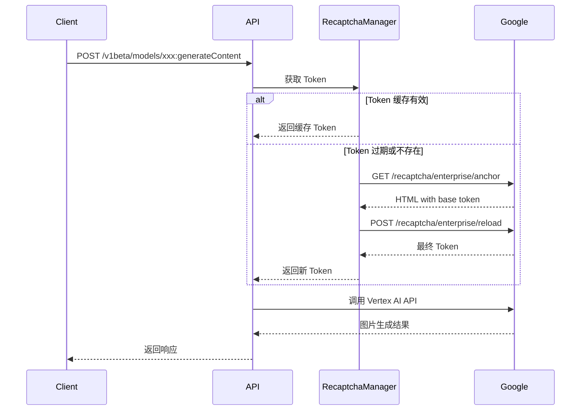
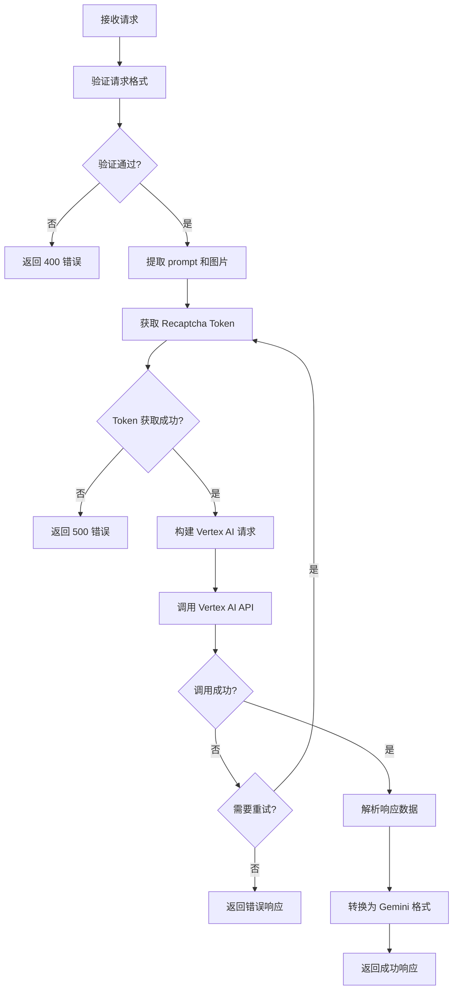

# Vertex AI Anonymous to Gemini API 架构设计

## 项目概述

将 Vertex AI Anonymous 的图片生成功能封装为标准的 Google Gemini API 格式，提供 HTTP 服务。

## 项目结构

```
2api/
├── app/
│   ├── __init__.py
│   ├── main.py                 # FastAPI 应用入口
│   ├── config.py               # 配置管理
│   ├── models/
│   │   ├── __init__.py
│   │   ├── request.py          # 请求模型
│   │   └── response.py         # 响应模型
│   ├── services/
│   │   ├── __init__.py
│   │   ├── provider.py         # Vertex AI Anonymous Provider
│   │   ├── recaptcha.py        # Recaptcha 处理
│   │   └── session.py          # HTTP 会话管理
│   └── routers/
│       ├── __init__.py
│       └── generate.py         # 生成内容端点
├── tests/
│   ├── __init__.py
│   └── test_api.py
├── Dockerfile
├── docker-compose.yml
├── requirements.txt
├── .env.example
└── README.md
```

## API 设计

### 端点

```
POST /v1beta/models/{model}:generateContent
```

### 支持的模型

- `gemini-2.0-flash-preview-image-generation` - Gemini 2.0 图片生成
- `gemini-3-pro-image-preview` - Gemini 3 Pro 图片预览版

### 请求格式

```json
{
  "contents": [
    {
      "role": "user",
      "parts": [
        {
          "text": "生成一只可爱的猫咪"
        },
        {
          "inlineData": {
            "mimeType": "image/png",
            "data": "base64编码的图片数据..."
          }
        }
      ]
    }
  ],
  "generationConfig": {
    "temperature": 1,
    "topP": 0.95,
    "maxOutputTokens": 32768,
    "responseModalities": ["TEXT", "IMAGE"],
    "imageConfig": {
      "aspectRatio": "1:1",
      "imageSize": "1024"
    }
  },
  "safetySettings": [
    {
      "category": "HARM_CATEGORY_HARASSMENT",
      "threshold": "OFF"
    }
  ]
}
```

### 响应格式

```json
{
  "candidates": [
    {
      "content": {
        "parts": [
          {
            "text": "这是一只可爱的橘猫..."
          },
          {
            "inlineData": {
              "mimeType": "image/png",
              "data": "base64编码的图片数据..."
            }
          }
        ],
        "role": "model"
      },
      "finishReason": "STOP",
      "index": 0
    }
  ],
  "usageMetadata": {
    "promptTokenCount": 0,
    "candidatesTokenCount": 0,
    "totalTokenCount": 0
  },
  "modelVersion": "gemini-3-pro-image-preview"
}
```

## 核心组件

### 1. Recaptcha Token 管理器



### 2. 请求处理流程



### 3. 配置管理

| 环境变量 | 说明 | 默认值 |
|---------|------|--------|
| `HOST` | 服务监听地址 | `0.0.0.0` |
| `PORT` | 服务监听端口 | `8000` |
| `PROXY` | 代理服务器地址 | `None` |
| `TIMEOUT` | 请求超时时间（秒） | `120` |
| `MAX_RETRY` | 最大重试次数 | `3` |
| `TEXT_RESPONSE` | 是否返回文本 | `true` |
| `SYSTEM_PROMPT` | 系统提示词 | `None` |
| `VERTEX_AI_BASE_API` | Vertex AI API 地址 | `https://content-aiplatform.googleapis.com` |
| `RECAPTCHA_BASE_API` | Recaptcha API 地址 | `https://www.google.com` |

## 错误处理

### HTTP 状态码

| 状态码 | 说明 |
|--------|------|
| 200 | 成功 |
| 400 | 请求格式错误 |
| 500 | 内部服务器错误 |
| 503 | 服务暂时不可用（Recaptcha 失败） |

### 错误响应格式

```json
{
  "error": {
    "code": 400,
    "message": "请求格式错误：缺少 contents 字段",
    "status": "INVALID_ARGUMENT"
  }
}
```

## Docker 部署

### Dockerfile 设计要点

- 使用 Python 3.11+ 基础镜像
- 使用 multi-stage build 减小镜像体积
- 非 root 用户运行
- 健康检查端点

### docker-compose.yml

- 支持环境变量配置
- 日志持久化
- 自动重启策略

## 安全考虑

1. **无认证模式**：当前设计不包含 API 认证，适用于内部使用
2. **代理支持**：支持配置代理服务器访问 Google 服务
3. **请求限制**：可通过反向代理（如 Nginx）添加速率限制

## 扩展性

1. **模型扩展**：通过配置添加新模型支持
2. **多 Provider 支持**：架构支持添加其他图片生成 Provider
3. **流式响应**：预留流式响应接口（当前未实现）