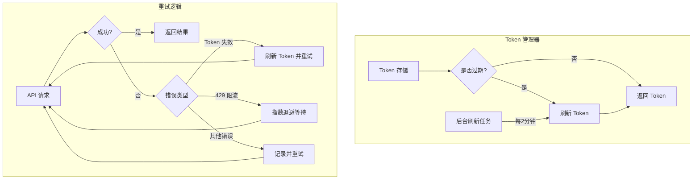

# Token 刷新与重试机制改进方案

## 问题概述

### 当前问题
1. **reCAPTCHA Token 过期**：Token 缓存后没有过期管理，约5-10分钟后失效
2. **429 错误处理不足**：没有指数退避，重试策略不够智能

### 影响
- 用了几次后请求开始失败
- 重试时没有等待，加剧了 429 问题

## 解决方案架构



## 详细改进方案

### 1. RecaptchaManager 改进

**文件**: [`app/services/recaptcha.py`](../app/services/recaptcha.py)

**改进内容**:
- 添加 token 创建时间戳
- 添加 token 有效期配置（默认2分钟）
- 实现后台定时刷新任务
- 优化并发刷新逻辑

```python
class RecaptchaManager:
    def __init__(self):
        self._token: str | None = None
        self._token_created_at: float | None = None
        self._lock = asyncio.Lock()
        self._refresh_task: asyncio.Task | None = None
        self._session: AsyncSession | None = None
    
    @property
    def is_token_expired(self) -> bool:
        """检查 token 是否过期"""
        if self._token is None or self._token_created_at is None:
            return True
        elapsed = time.time() - self._token_created_at
        return elapsed >= settings.token_ttl
    
    async def start_background_refresh(self, session: AsyncSession):
        """启动后台刷新任务"""
        self._session = session
        if self._refresh_task is None:
            self._refresh_task = asyncio.create_task(self._background_refresh_loop())
    
    async def _background_refresh_loop(self):
        """后台定时刷新 token"""
        while True:
            await asyncio.sleep(settings.token_refresh_interval)
            try:
                await self.invalidate_and_refresh(self._session)
            except Exception as e:
                logger.error(f"Background token refresh failed: {e}")
```

### 2. 指数退避重试策略

**文件**: [`app/services/provider.py`](../app/services/provider.py)

**改进内容**:
- 添加指数退避算法
- 区分错误类型进行不同处理
- 添加最大等待时间限制

```python
async def generate_content(self, model: str, request: GenerateContentRequest):
    base_delay = settings.retry_base_delay  # 1秒
    max_delay = settings.retry_max_delay    # 30秒
    
    for attempt in range(settings.max_retry):
        result, status, error_msg = await self._call_api(body)
        
        if result is not None:
            return self._build_response(result, model), None
        
        # 根据错误类型决定处理方式
        if status == 3:  # Token 失效
            recaptcha_token = await recaptcha_manager.invalidate_and_refresh(self.session)
            # 不需要额外等待
            
        elif status == 8:  # 429 Resource Exhausted
            delay = min(base_delay * (2 ** attempt), max_delay)
            jitter = random.uniform(0, delay * 0.1)
            wait_time = delay + jitter
            logger.warning(f"Rate limited, waiting {wait_time:.1f}s before retry")
            await asyncio.sleep(wait_time)
            
        elif status == 999:  # 内容被阻止，不重试
            return None, error_msg
            
        else:
            # 其他错误，短暂等待后重试
            await asyncio.sleep(base_delay)
```

### 3. 配置项添加

**文件**: [`app/config.py`](../app/config.py)

**新增配置**:
```python
# Token 配置
token_ttl: int = Field(
    default=120,  # 2分钟
    description="Token 有效期（秒）"
)
token_refresh_interval: int = Field(
    default=90,  # 1.5分钟
    description="Token 后台刷新间隔（秒）"
)

# 重试配置
retry_base_delay: float = Field(
    default=1.0,
    description="重试基础延迟（秒）"
)
retry_max_delay: float = Field(
    default=30.0,
    description="重试最大延迟（秒）"
)
```

### 4. 生命周期管理

**文件**: [`app/main.py`](../app/main.py)

**改进内容**:
- 启动时初始化后台刷新任务
- 关闭时清理资源

```python
@asynccontextmanager
async def lifespan(app: FastAPI):
    # 启动
    session = await get_session()
    await recaptcha_manager.start_background_refresh(session)
    
    yield
    
    # 关闭
    await recaptcha_manager.stop_background_refresh()
    await close_session()
```

## 改进效果

| 问题 | 改进前 | 改进后 |
|------|--------|--------|
| Token 过期 | 被动刷新，用户感知到错误 | 主动刷新，用户无感知 |
| 429 错误 | 立即重试，加剧问题 | 指数退避，自动恢复 |
| 重试间隔 | 无等待 | 1s → 2s → 4s → 8s... |
| 最大等待 | 无限制 | 30秒上限 |

## 文件修改清单

1. **`app/config.py`** - 添加新配置项
2. **`app/services/recaptcha.py`** - 实现后台刷新和过期管理
3. **`app/services/provider.py`** - 实现指数退避重试
4. **`app/main.py`** - 添加生命周期管理
5. **`.env.example`** - 添加新配置项示例

## 风险评估

- **低风险**：改进是向后兼容的
- **配置可调**：所有参数都可通过环境变量调整
- **优雅降级**：后台刷新失败不影响被动刷新

## 下一步

确认此方案后，切换到 Code 模式实施具体代码改进。